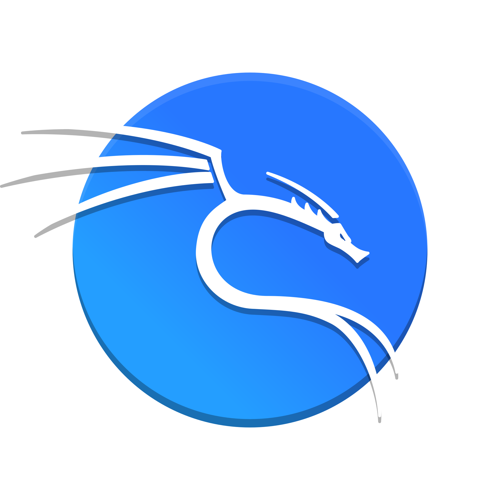

# ABOUT ME
 
          

## BIO

I am a second-year student pursuing a degree in Information Security at the <b>HSE</b> Russia.

I am interested in <b>cybersecurity</b>, vulnerabilities and methods to mitigate them. I practice by playing <b>CTF</b> (Capture The Flag) games and using the Try Hack Me platform and others. Additionally, I am participating in a project CAVISE focused on developing an environment for training autonomous vehicles. Recently, under my leadership, our project made a breakthrough by implementing the most realistic model of communication between vehicles.

### Contacts

## Languages and Tools

### Skils:
- Programming
- Owasp Top 10 
- Pentest Methodology
- TCP/IP
- Network Utilities
- WEB
- Сryptography

### Languages:
| Python3 | BASH | C++ |
|----------|----------|----------|
| &nbsp; | &nbsp; | &nbsp; |

### Tools:
| Docker | VirtualBox | VMware | Git | Pytest | BurpSuite | SemGrep |
|----------|----------|----------|----------|----------|----------|----------|
| &nbsp; | &nbsp; | &nbsp; | &nbsp; | &nbsp; | &nbsp; | &nbsp; |
          

### OS:
| Linux | Manjaro | Ubuntu | Kali |
|----------|----------|----------|----------|
| &nbsp; | &nbsp; |&nbsp; | &nbsp; |

